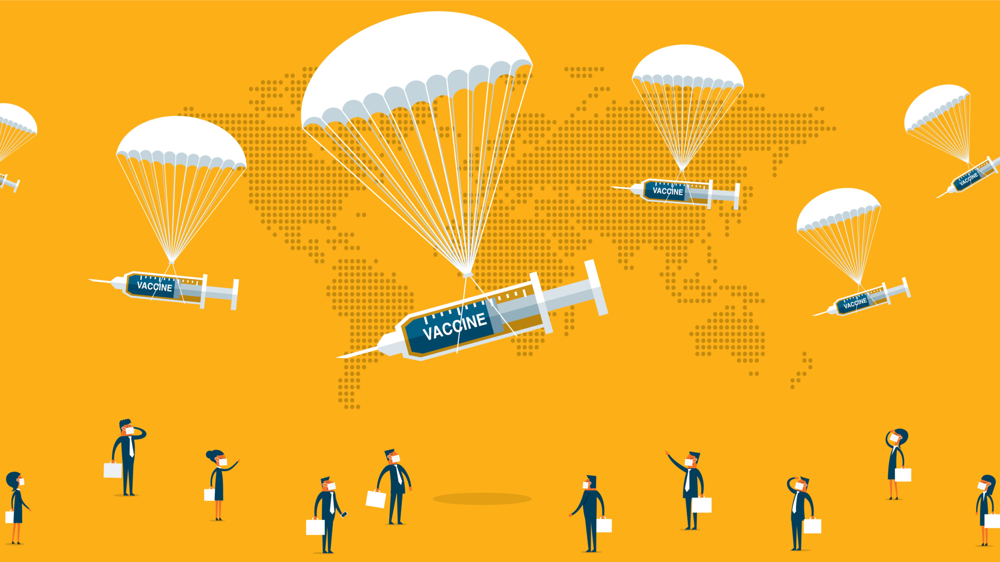

## My Data Science Portfolio

### [Github Data Science Portfolio](https://github.com/pchougule-ms/pchougule-ms/tree/main/Data%20Science%20Portfolio)

### Below projects are part of my Data Science portfolio

<h3 align="center"> <a href="https://github.com/pchougule-ms/pchougule-ms/tree/main/Data%20Science%20Portfolio/Airline%20Safety"> Airline Safety - Facts vs. Myths </a></h3>
  

This project focused on the - Data Visualization and Storytelling aspects of the Data Science using variety of tools like Tableau and Power BI along with Infographics designs and blogs.

Airline Safety study aims to verify and present the safety facts for air travels and how it compares with other modes of transportation. The study highlights how the air travel has made major improvements in terms of safety over the past few decades and is in fact the safest form of travel

 

<h3 align="center"> <a href="https://github.com/pchougule-ms/pchougule-ms/tree/main/Data%20Science%20Portfolio/COVID-19%20Cases%20and%20Vaccination%20supplies%20study"> COVID-19 Cases and Vaccination Supplies Study </a></h3>
  

This project served as a great opportunity to learn about the Data Preparation / Data Wrangling and Analytics activities as a part of the Data Science project life cycle. The techniques like Discovering / Understanding the data, Web-scrapping, Cleaning and Enriching, Subsetting / Structuring / Formatting, Validating and Visualizing aspects.

As a part of this project, I looked at the various statistics in terms of COVID-19 cases world-wide as well within USA and different states. Additionally, performed analysis of the vaccine supplies to various states with USA in comparison with the case counts. This helped understand that the impact of COVID-19 cases was one of the major driving factors in distributing the vaccine supplies appropriately to the states.

 

<h3 align="center"> Auto Insurance Claims Exploratory Data Analysis using Python </h3>

 

<h3 align="center"> Credit Card Lead Predictions </h3>

 

<h3 align="center"><a href="https://github.com/pchougule-ms/pchougule-ms/tree/main/Data%20Science%20Portfolio/Current%20Day%20Weather%20Forecast">Current Day Weather Forecast </a></h3>

 

<h3 align="center"><a href="https://github.com/pchougule-ms/pchougule-ms/tree/main/Data%20Science%20Portfolio/Housing%20Prices%20EDA"> Housing Prices Exploratory Data Analysis using R </a></h3>

 

<h3 align="center"><a href="https://github.com/pchougule-ms/pchougule-ms/tree/main/Data%20Science%20Portfolio/Telecom%20Company%20Customer%20Churn%20Predictions"> Telecom Company Customer Churn Predictions </a></h3>

 

